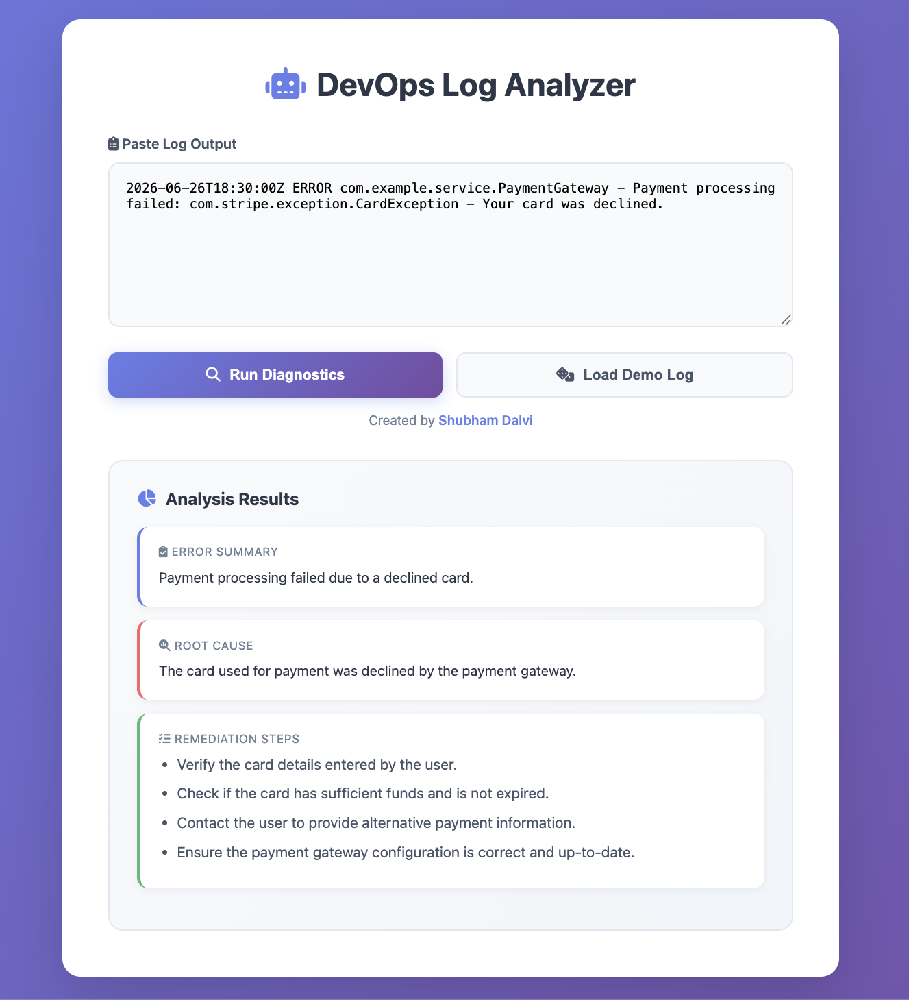

# Serverless Log Analyzer

## Project Overview

This project demonstrates a fully serverless, AI-powered diagnostic application. It allows a user (e.g., a DevOps engineer) to paste in a cryptic error log from their browser and receive clear, actionable diagnostics generated by Amazon Bedrock (AI). The entire architecture is built on AWS services, making it scalable and cost-effective.

## Architecture

## How it Works (The Flow)

The diagram follows a standard request-response pattern:

### 1. Accessing the App (Arrows 1 & 2)

- **Arrow 1:** Because the web application (the `index.html` file) is stored in a **private S3 Bucket**, the user cannot access it directly. The project uses an **S3 Presigned URL** to grant temporary access. This URL is a time-limited token that loads the web app in the user's browser.
- **Arrow 2:** The user types a raw error log into the web UI and clicks "Run Diagnostics." The browser (via JavaScript) sends this log data in a standard **REST API POST call** (fetch request) to the backend.

### 2. Securing the Backend (The Purple Box)

- **Authentication:** When the POST call arrives at **Amazon API Gateway**, the request is immediately validated. This is not a public endpoint. The project uses an **API Key** for security. The web app must include this specific key (the value starting `fYLZRVP8v...`) in its header, or the request is rejected as 'Forbidden'.

### 3. Processing the Request (Arrows 3 & 4)

- **Arrow 3:** Once authenticated, API Gateway triggers **AWS Lambda**, the core execution environment. This is a serverless Python function named `DevOpsLogAnalyzerEngine`.
- **Arrow 4:** The Python code inside Lambda takes the raw log text provided by the user. It constructs a precise prompt and sends that prompt to the **Amazon Bedrock (AI Model)** using the boto3 library. This request asks the AI to analyze the log, identify the error, determine the root cause, and list remediation steps.

### 4. AI Analysis (Arrow 5)

- **AI Model:** Amazon Bedrock runs the **Nova Lite model** (`amazon.nova-lite-v1:0`). It receives the structured prompt and analyzes the log snippet (`"log": "ERROR: Timeout..."`).

### 5. AI Response

The AI generates a structured JSON response (visible in the diagram), identifying the error as a "Connection Refused," the cause as the database being unreachable, and providing concrete steps to fix it.

### 6. Delivering the Solution (Arrows 6 & 7)

- **Arrow 6:** Lambda receives the AI's diagnostic JSON response and formats it.
- **Arrow 7:** The formatted JSON data is returned through API Gateway to the user's browser. The web UI immediately displays the human-readable "Error Summary," "Root Cause," and "Remediation Steps."

### 7. Auditing and Logging (Arrow 8)

For testing and security audits, all activity within the Lambda function (the function execution time, inputs, and outputs) is automatically recorded in **Amazon CloudWatch Logs**.

## Final Product

## Resources

- [Full Instructions](genai-log-analyzer.md)
- [Lambda Code](lambda-code-log-analyzer.py)
- [HTML Code](genai-demo.html)
